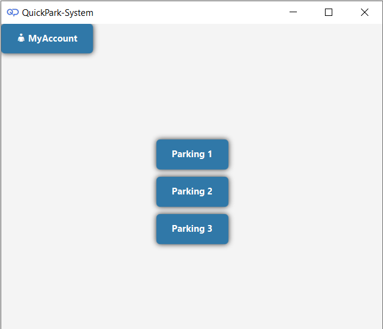
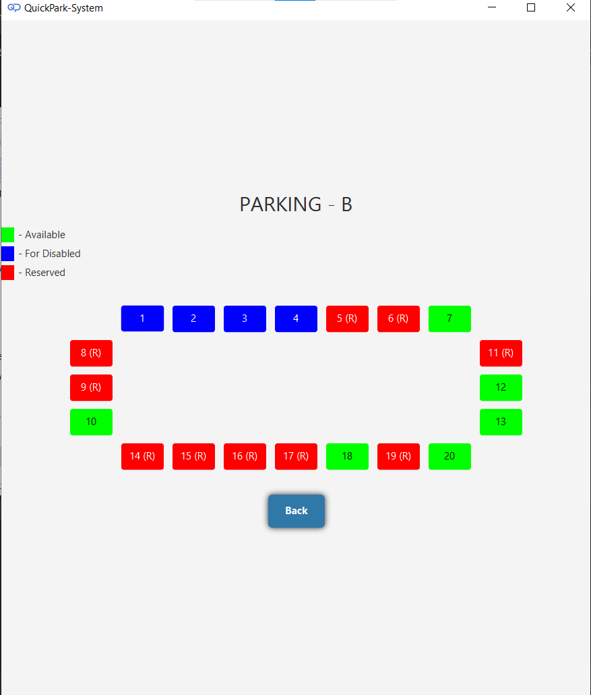

# QuickPark-System

---

*This project represents my first foray into full application development using Java and JavaFX for the user interface. Throughout the development process, I extensively used Maven for dependency management and build automation, improving the efficiency and scalability of the project.*

*This effort focused on leveraging the capabilities of Java to create a functional and user-friendly parking reservation system. It was an enriching experience during which I applied and expanded my understanding of the potential of Java to create practical and efficient software solutions.*

*The project not only solidified my Java skills but also provided valuable insights into modern software development practices.*

---


# Introduction
*The QuickPark System is an intuitive parking reservation application that simplifies the process of finding and booking parking spots, providing users with a hassle-free experience.*

---

## Features
- Multiple parking selections
- Real-time availability of parking spots
- Flexible reservation durations
- Option for receiving receipts or invoices

---

## User Workflow
### Login and Registration


*New users can create an account using the 'Register' option, while returning users can log in with their username and password.*


### Dashboard


*After logging in, users can check reservation history, balance or either reserve spot.* 

- Reservation Details Pages:

  | Page 1 |             Page 2             |             Page 3             |
  |:------:|:------------------------------:|:------------------------------:|
  |  |  |  |

### Additional Screens

- **Reservation Dialog**

  

- **Balance Overview**

  

### Parking Selection


Users can select from various parking areas like Parking A, Parking B, Parking C.

|   Parking-A    |   Parking-B    |   Parking-C    |
|:--------------:|:--------------:|:--------------:|
|  |  |  |

*Users can view the layout of the selected parking area showing available and occupied spots.*

### Spot Reservation


*They can select an available spot and choose the reservation duration.*


### Payment and Invoicing


*Users can choose to receive a receipt or an invoice.*

---

## Sample Documents
### Invoice


*A detailed invoice is provided for those who need an official record of their parking reservation. It includes comprehensive information like the parking location, specific spot number, duration of the reservation, and the total amount charged.*

### Receipt


*For those who prefer a simpler documentation of their transaction, a straightforward receipt option is available. It's a convenient choice for users who do not require a formal invoice.*

---

## Building and Running the Project

### Clone the Repository
First, clone the repository to your local machine using this command:

```
git clone git@github.com:xFusek/QuickPark-System.git
```

### Build the Project Using Maven Wrapper
To build the project, navigate to the root directory of the project and run the following command:

```
mvnw clean install
```

### Run the Project with Maven Wrapper
After building the project, you can run it using this command:

```
mvnw exec:java
```

---


